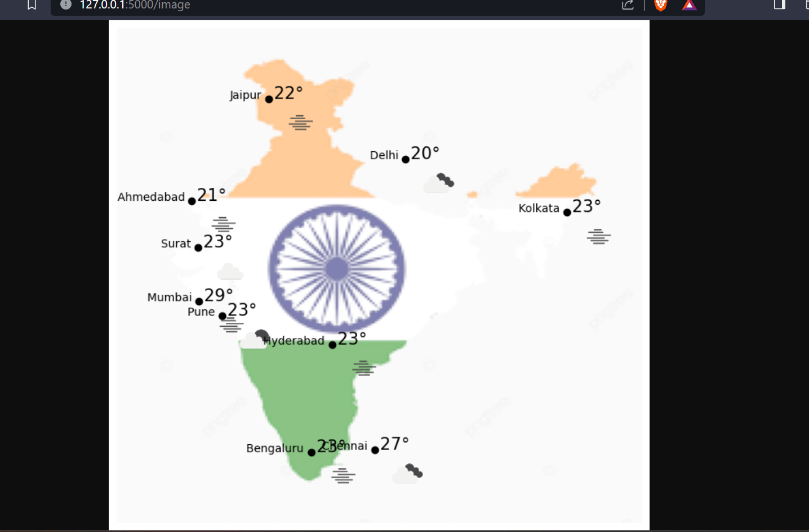
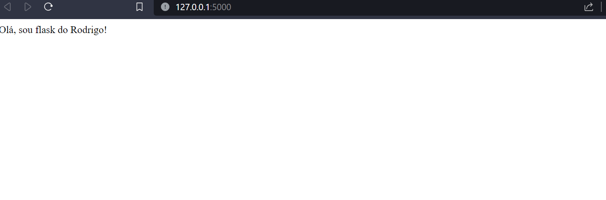

# ATIVIDADE_PROGRAMACAO_ETL

# Visão Geral
Este repositório contém código para uma simples aplicação web Flask que obtém dados meteorológicos da API OpenWeather para 10 cidades na Índia. Os dados incluem temperatura, descrição do tempo e horário do pôr do sol. A aplicação, então, plota essas cidades em um mapa junto com suas temperaturas correspondentes.

# Ferramentas e Bibliotecas

Flask: Você pode instalar o Flask usando o comando pip install flask
Requests: Você pode instalar o Requests usando o comando pip install requests
Pandas: Você pode instalar o Pandas usando o comando pip install pandas
Geopy: Você pode instalar o Geopy usando o comando pip install geopy
Geopandas: Você pode instalar o Geopandas usando o comando pip install geopandas
Contextily: Você pode instalar o Contextily usando o comando pip install contextily
Matplotlib: Você pode instalar o Matplotlib usando o comando pip install matplotlib

# Explicação do Código
O código obtém dados meteorológicos da API OpenWeather para 10 cidades na Índia, incluindo temperatura, descrição de latitude e longitude, e horário do pôr do sol. Em seguida, plota essas cidades em um mapa, baseado na latitude e longitude, exibindo ícones que representam as condições meteorológicas.
Importante ressaltar, que o dados primeiramente são recebidos em json e transformador em dataframe pandas para facilitar a manipulação

# Flask
A aplicação Flask fornece uma interface web simples onde você pode visualizar o mapa.

# Teste
http://127.0.0.1:5000/image
  

  
http://127.0.0.1:5000/
  

